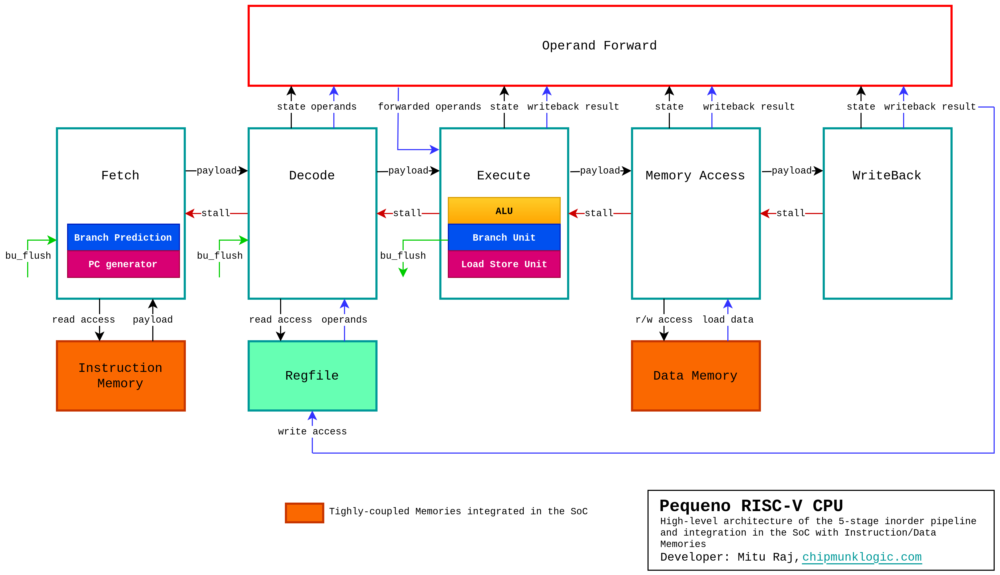

# Pequeno RISC-V
Pequeno (meaning "_tiny_" in Spanish) aka _PQR5_ is a 5-staged pipelined in-order RISC-V CPU Core compliant with RV32I ISA.
The core is bare RTL designed in System Verilog, balanced for area/performance, and portable across platforms like FPGA, ASIC.

  

## Overview
- RV32I ISA v2.2
- Single-core, Single-issue, In-order execution
- Classic 5-stage RISC-V pipeline
- Intended for baremetal embedded applications, not OS & interrupt capable.

                                             ____________________________
                                            / CHIPMUNK LOGIC            /\
                                           /                           / /\ 
                                          /     =================     / /
                                         /     / P e q u e n o  /   / \/
                                        /     /  RISC-V 32-bit /    /\
                                       /     /================/    / /
                                      /___________________________/ /
                                      \___________________________\/
                                       \ \ \ \ \ \ \ \ \ \ \ \ \ \ \
  
        chipmunklogic.com                                                    [[[[[[[ O P E N - S O U R C E _
## Feature set
| **CPU Feature Set**                        |                                           |
|--------------------------------------------|-------------------------------------------|
| **ISA**                                    | RV32I, user-level v2.2                    |
| **Instructions**                           | All 37 base instructions                  |
| **Cores**                                  | 1                                         |
| **Issue**                                  | One instruction per cycle                 |
| **Pipeline depth**                         | 5                                         |
|                                            | Fetch, Decode, Execution, Memory Access, Writeback |
| **Execution model**                        | In-order
| **Bus architecture**                       | Harvard, separate instruction/data bus    |
| **Branch prediction**                      | Yes, static                               |
| **Cache**                                  | Not available, but can be integrated externally |
| **OS capable**                             | No, privilege modes are not supported     |
| **Interrupt/Exceptions capable**           | No                                        |

## Configuration options
| Parameter / Macro                          |                                           |
|--------------------------------------------|-------------------------------------------|
| RF_IN_BRAM                                 | Maps Register File to Block RAM instead of LUT RAM/Flops
| PC_INIT                                    | Reset PC vector

## Functional Block Diagram

## PQR5ASM, The tailor-made Assembler
   This RV32I assembler supports all 37 base instructions + 16 pseudo instructions 
   
  _Assembler and Instruction Manual_: 
  https://github.com/iammituraj/pqr5asm

## Pequeno in Action!  
  * FPGA demo video of Pequeno running [Hello world!](https://youtu.be/GECyL9U5ZxI)

  * FPGA demo video of Pequeno being flashed by peqFlash through serial interface (UART) and running [Blinky LED program](https://www.youtube.com/watch?v=cEEZbzSd6v0)

_The validation was done on Xilinx Artix-7 based FPGA boards Basys-3, CMOD-A735T_

## FPGA Resource Utilization
| **Synthesis summary**                      |                                           |
|--------------------------------------------|-------------------------------------------|
| **Core version** | v1.1_beta
| **Configuration**| Register File in LUT RAMs
| **Target** | Artix-7, xc7a35tcpg236-1
| **LUTs** | 1060
| **Registers** | 551
| **Max clock freq** | 115 MHz
| **Max clock freq in fastest Artix-7 speed grade** | 165 MHz

## CoreMark®
| **Performance Validation**                 |                                           |
|--------------------------------------------|-------------------------------------------|
| **Core version** | v1.1_beta
| **CoreMark score** | 0.75 CoreMark/MHz 
| **Iterations** | 400
| **Iterations per second** | 9
| **Test clock freq** | 12 MHz
| **Test platform** | FPGA
| **Full Report** | [coremark/coremark_report.html](https://raw.githack.com/iammituraj/pequeno_riscv/main/coremark/coremark_report.html)

# Pequeno in Blog
Follow the journey of Pequeno in my blog, how this RISC-V CPU was designed in RTL from scratch: [pequeno blogs in chipmunklogic.com](https://chipmunklogic.com/category/pequeno-cpu/)

# Important
Please go through [readme_database](readme_database) for complete info about this repo database and how to setup the PQR5 build environment.

# Disclaimer
This CPU core is intended for educational purposes only.
The users must review the accompanying license document ([LICENSE](LICENSE)) for detailed terms and conditions before the use.

# Developer
Mitu Raj, [Chipmunk Logic](https://chipmunklogic.com), chip@chipmunklogic.com
