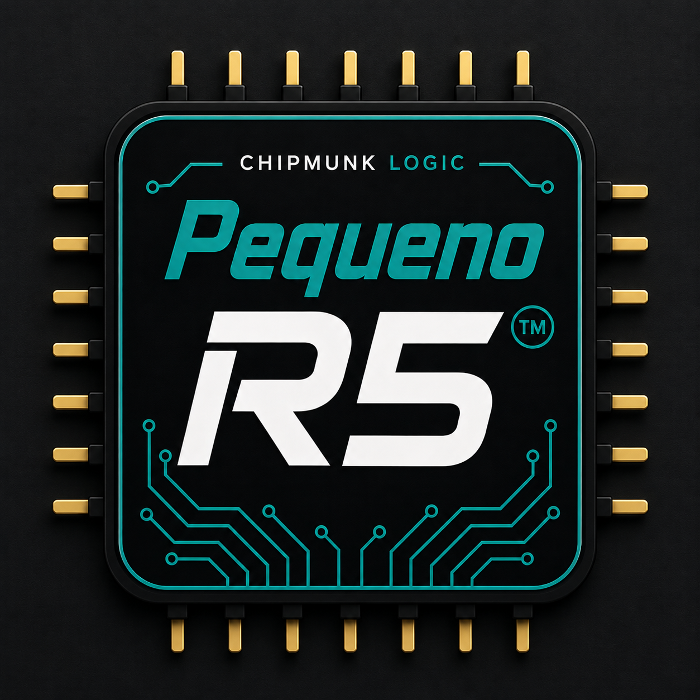
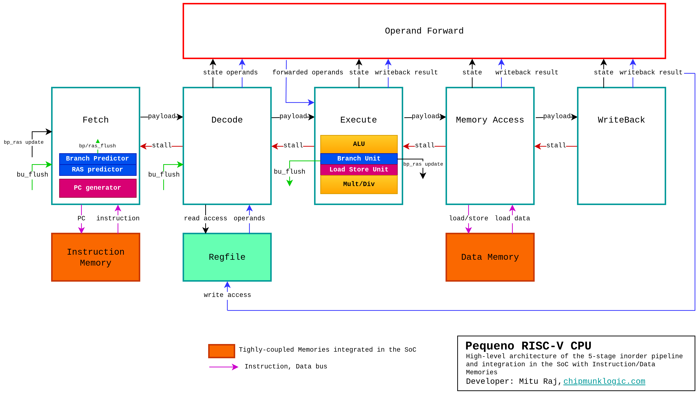

# Pequeno RISC-V

**Pequeno R5** (meaning "_tiny_" in Spanish) aka _PQR5_ is a 5-staged pipelined in-order RISC-V CPU Core compliant with RV32IM ISA.
The core is bare RTL designed in System Verilog, and is highly configurable. The implementation is balanced for area/performance, and portable across platforms like FPGA, ASIC.

  

## About this repo
This repository is a complete framework for building, compiling, verifying, and evaluating the Pequeno CPU core.  
The project is fully driven by a comprehensive Makefile-based toolchain for end-to-end build automation and flow control.

This ecosystem lets you-
* Configure the Pequeno R5 CPU and subsystem using **Configurator** tool.
  Run the command `make configurator` to launch this menu-driven, interactive configurator
* Build example Assembly/C programs and compile it with the subsystem for simulation/synthesis.
* Build Benchmark programs and compile it with subsystem for simulation/synthesis.
* Run regressions to check sanity.
* Flash program binaries on-the-fly thru UART with peqFlash tool.

This streamlined setup allows users to quickly experiment with configurations, validate functionality, and measure performance metrics, all from a single unified interface.

Run `make help` to get the full set of Makefile recipes available.

Please go through [readme_database](readme_database) and [build_notes](https://github.com/iammituraj/pequeno_riscv/blob/main/build_notes.txt) for complete info about the organization of this repo database and how to setup the PQR5 build environment in your machine.

## Overview
- RV32IM User-level ISA [v2.2](https://cs.brown.edu/courses/csci1952y/2024/assets/docs/riscv-spec-v2.2.pdf)
- Single-core, Single-issue, In-order execution
- Classic 5-stage RISC pipeline
- Intended for baremetal embedded applications, not OS & interrupt capable (YET!).

                                             ____________________________
                                            / CHIPMUNK LOGIC            /\
                                           /                           / /\ 
                                          /     =================     / /
                                         /     / P e q u e n o  /   / \/
                                        /     /  RISC-V 32-bit /    /\
                                       /     /================/    / /
                                      /___________________________/ /
                                      \___________________________\/
                                       \ \ \ \ \ \ \ \ \ \ \ \ \ \ \
  
        chipmunklogic.com                                                    [[[[[[[ O P E N - S O U R C E _
## Feature set
| **CPU Feature Set**                        |                                           |
|--------------------------------------------|-------------------------------------------|
| **ISA**                                    | RV32IM, user-level v2.2                    |
| **Instructions**                           | All 45 instructions in RV32IM                |
|                                            | 37 Base Integer + 8 MULT/DIV instructions |
| **Cores**                                  | 1                                         |
| **Issue**                                  | One instruction per cycle                 |
| **Pipeline depth**                         | 5                                         |
|                                            | Fetch, Decode, Execution, Memory Access, Writeback |
| **Execution model**                        | In-order
| **Bus architecture**                       | Harvard, separate instruction/data bus    |
| **Branch prediction**                      | Yes, static/dynamic + RAS                               |
| **Multipliers & Dividers**                 | Yes, M-extension  |
|                                            | x32 bit Radix-4 Booth multiplier (16 cycles) / DSP multiplier for FPGAs (3 cycles) |
|                                            | x32 bit Non-restoring divider (32 cycles)
| **Cache**                                  | Not available, but can be integrated externally |
| **OS capable**                             | No, privilege modes are not supported     |
| **Interrupt/Exceptions capable**           | No                                        |

## Configuration options

The CPU is highly configurable and can be tuned according to the targetted application.

| Parameter / Macro                          |                                           |
|--------------------------------------------|-------------------------------------------|
| **RF_ON_BRAM**                             | Maps Register File to Block RAM instead of LUT RAM/Flops
| **BPREDICT_DYN**                           | Enable Dynamic Branch Predictor (GShare)
| **BHT_IDW**                                | Branch History Table (BHT) ID width
| **BHT_TYPE**                               | BHT target (Block RAM/LUTRAM/Flops)
| **RAS**                                    | Enable Return Address Stack (RAS) predictor
| **RAS_DPT**                                | RAS depth
| **MULTDIV**                                | Enable HW multipliers/dividers
| **EN_FPGA_DSP_MULT**                       | Set multiplier = DSP multiplier for FPGAs
| **MULT_PIPE_STAGES**                       | No. of pipeline stages in the DSP multiplier
| **PC_INIT**                                | Reset PC vector

### Sample CPU configurations 
| Configuration                              |                                           |
|--------------------------------------------|-------------------------------------------|
| **Light**                                  | Static branch predictor
| **Performance**                            | Dynamic branch predictor
| **Performance++**                          | Dynamic branch predictor + RAS

These are base configurations. Combine them with Multiplier/Divider to get M/MDSP Light/Performance/Performance++ configurations.
## Functional Block Diagram

## Validation of the CPU core
- The CPU core was verified using the standard [RISC-V tests and benchmarks](https://github.com/riscv-software-src/riscv-tests/tree/master/benchmarks).
- The CPU core was also verified by the regression tests available in this package
- The CPU core also passed CoreMark® and Dhrystone Benchmarks on board

## PQR5ASM, the tailor-made Assembler
   This RV32IM assembler supports all 45 base instructions + 16 pseudo instructions. All the example ASM programs in the repo uses this assembler
   to build the binaries.
   
  _Assembler and Instruction Manual_: 
  https://github.com/iammituraj/pqr5asm

## Pequeno in action!  
  * FPGA demo video of Pequeno running [Hello world!](https://youtu.be/GECyL9U5ZxI)

  * FPGA demo video of Pequeno being flashed by peqFlash through serial interface (UART) and running [Blinky LED program](https://www.youtube.com/watch?v=cEEZbzSd6v0)

> The validation was done on Xilinx Artix-7 based FPGA boards Basys-3, CMOD-A735T

## FPGA Resource Utilization
The CPU is highly configurable. The resource utilization, timing performance, and CPU performance depends on the configuration.
| **Synthesis summary**                      |                                           |
|--------------------------------------------|-------------------------------------------|
| **Core version** | v1.1
| **Target** | Artix-7, xc7a35tcpg236-1
| **Synthesis options**| Balanced, Don't flatten hierarchy, Keep equivalent registers

| Configuration | LUTs | Flops | BRAMs | DSPs | CoreMark/MHz | Dhrystone (DMIPS/MHz) | Max clock freq (MHz)
|---------------|------|-----------|-------|------|--------------|-------------------|--------------------|
| Light         | **954** 🪶 | **565** 🪶 | 0 | 0 | 0.97 | 1.05 | 114
| Performance   | 1094 | 642 | 0 | 0 | 1.01 | 1.11 | 114
| Performance++ | 1266 | 770 | 0 | 0 | 1.03 | **1.19** 🚀 | 114
| M Light         | 1388 | 888 | 0 | 0 | 1.85 | 1.04 | 114
| M Performance   | 1528 | 965 | 0 | 0 | 1.92 | 1.08 | 114
| M Performance++ | 1700 | 1093 | 0 | 0 | 1.93 | 1.15 | 114
| MDSP Light         | 1374 | 820 | 0 | 4 | 2.50 | 1.07 | 114
| MDSP Performance   | 1514 | 897 | 0 | 4 | 2.63 | 1.11 | 114
| MDSP Performance++ | 1686 | 1025 | 0 | 4 | **2.65** 🚀 | **1.18** 🚀 | **114**

> Max clock freq achieved in the fastest Artix-7 speed grade =  160 MHz (Performance++)

## CoreMark® and Dhrystone
The Pequeno R5 CPU has been validated with CoreMark® and Dhrystone benchmarks with performance reaching up to **2.65 CoreMark/MHz** and **1.19 DMIPS/MHz**.

| **Performance Validation**                 |                                           |
|--------------------------------------------|-------------------------------------------|
| **Core version** | v1.1
| **Configuration**| MDSP Performance++
| **CoreMark score** | **2.65 CoreMark/MHz**, 400 iterations
| **Dhrystone score** | **1.18 DMIPS/MHz**, 50000 iterations
| **Test platform** | FPGA
| **CoreMark Report** | [coremark/coremark_report.html](https://raw.githack.com/iammituraj/pequeno_riscv/main/coremark/coremark_report.html)
| **Dhrystone Report** | [dhrystone/dhrystone_run.png](https://raw.githack.com/iammituraj/pequeno_riscv/main/dhrystone/dhrystone_report.html)

# Pequeno in Blog (Chipmunk Logic™)
Follow the journey of the Pequeno in my blog, how this RISC-V CPU was designed in RTL from scratch: [pequeno blogs in chipmunklogic.com](https://chipmunklogic.com/category/pequeno-cpu/)

# License & Disclaimer
This CPU core is intended for education/research/evaluation purposes only. 
The users must review the accompanying license document ([LICENSE](LICENSE)) and [NOTICE](NOTICE)) for detailed terms and conditions before the use.

# Developer
Mitu Raj, [Chipmunk Logic](https://chipmunklogic.com), chip@chipmunklogic.com
