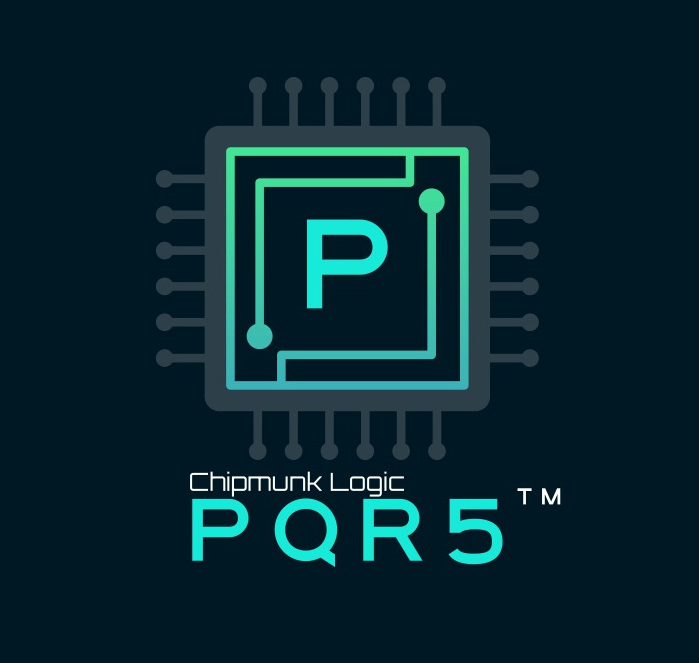

# Pequeno RISC-V

Pequeno (meaning "_tiny_" in Spanish) aka _PQR5_ is a 5-staged pipelined in-order RISC-V CPU Core compliant with RV32I ISA.
The core is bare RTL designed in System Verilog, and is highly configurable. The implementation is balanced for area/performance, and portable across platforms like FPGA, ASIC.

  

## About this repo
This repository is a complete framework for developing, verifying, and evaluating the Pequeno CPU core.  
The project is fully driven by a Makefile, enabling seamless execution of the entire workflow: from compiling the CPU & Subsystem RTL, compiling and building
example assembly/C/RISC-V test/Benchmark programs, running simulations, synthesizing the design for FPGA targets and programming the bitfile, and flashing using custom flash program, peqFlash. 

This streamlined setup allows users to quickly experiment with configurations, validate functionality, and measure performance metrics, all from a single unified interface.

Run `make help` to get the full set of Makefile recipes available.

Please go through [readme_database](readme_database) for complete info about this repo database and how to setup the PQR5 build environment.

## Overview
- RV32I User-level ISA [v2.2](https://cs.brown.edu/courses/csci1952y/2024/assets/docs/riscv-spec-v2.2.pdf)
- Single-core, Single-issue, In-order execution
- Classic 5-stage RISC pipeline
- Intended for baremetal embedded applications, not OS & interrupt capable (YET!).

                                             ____________________________
                                            / CHIPMUNK LOGIC            /\
                                           /                           / /\ 
                                          /     =================     / /
                                         /     / P e q u e n o  /   / \/
                                        /     /  RISC-V 32-bit /    /\
                                       /     /================/    / /
                                      /___________________________/ /
                                      \___________________________\/
                                       \ \ \ \ \ \ \ \ \ \ \ \ \ \ \
  
        chipmunklogic.com                                                    [[[[[[[ O P E N - S O U R C E _
## Feature set
| **CPU Feature Set**                        |                                           |
|--------------------------------------------|-------------------------------------------|
| **ISA**                                    | RV32I, user-level v2.2                    |
| **Instructions**                           | All 37 base instructions                  |
| **Cores**                                  | 1                                         |
| **Issue**                                  | One instruction per cycle                 |
| **Pipeline depth**                         | 5                                         |
|                                            | Fetch, Decode, Execution, Memory Access, Writeback |
| **Execution model**                        | In-order
| **Bus architecture**                       | Harvard, separate instruction/data bus    |
| **Branch prediction**                      | Yes, static/dynamic + RAS                               |
| **Cache**                                  | Not available, but can be integrated externally |
| **OS capable**                             | No, privilege modes are not supported     |
| **Interrupt/Exceptions capable**           | No                                        |

## Configuration options
| Parameter / Macro                          |                                           |
|--------------------------------------------|-------------------------------------------|
| **RF_ON_BRAM**                             | Maps Register File to Block RAM instead of LUT RAM/Flops
| **BPREDICT_DYN**                           | Enable Dynamic Branch Predictor (GShare)
| **BHT_IDW**                                | Branch History Table (BHT) ID width
| **BHT_TYPE**                               | BHT target (Block RAM/LUTRAM/Flops)
| **RAS**                                    | Enable Return Address Stack (RAS) predictor
| **RAS_DPT**                                | RAS depth
| **PC_INIT**                                | Reset PC vector

## CPU configurations 
| Configuration                              |                                           |
|--------------------------------------------|-------------------------------------------|
| **Light**                                  | Static branch predictor
| **Standard**                               | Static branch predictor + RAS
| **Performance**                            | Dynamic branch predictor
| **Performance++**                          | Dynamic branch predictor + RAS

## Functional Block Diagram

## Validation of the CPU core
- The CPU core is verified using the standard [RISC-V tests and benchmarks](https://github.com/riscv-software-src/riscv-tests/tree/master/benchmarks).
- The CPU core is also verified by various regression test suite available in this package

## PQR5ASM, the tailor-made Assembler
   This RV32I assembler supports all 37 base instructions + 16 pseudo instructions. All the example programs in the repo uses this assembler
   to build the binaries.
   
  _Assembler and Instruction Manual_: 
  https://github.com/iammituraj/pqr5asm

## Pequeno in action!  
  * FPGA demo video of Pequeno running [Hello world!](https://youtu.be/GECyL9U5ZxI)

  * FPGA demo video of Pequeno being flashed by peqFlash through serial interface (UART) and running [Blinky LED program](https://www.youtube.com/watch?v=cEEZbzSd6v0)

> The validation was done on Xilinx Artix-7 based FPGA boards Basys-3, CMOD-A735T

## FPGA Resource Utilization
| **Synthesis summary**                      |                                           |
|--------------------------------------------|-------------------------------------------|
| **Core version** | v1.0.3
| **Target** | Artix-7, xc7a35tcpg236-1
| **Synthesis options**| Balanced, Don't flatten hierarchy, Keep equivalent registers

| Configuration | LUTs | Flops | BRAMs | DSPs | CoreMark/MHz | Dhrystone (DMIPS/MHz) | Max clock freq (MHz)
|---------------|------|-----------|-------|------|--------------|-------------------|--------------------|
| Light         | 1076 | 552 | 0 | 0 | 0.74 | 0.88 | 114
| Standard      | 1288 | 710 | 0 | 0 | 0.75 | 0.92 | 113
| Performance   | 1217 | 629 | 0 | 0 | 0.76 | 0.94 | 114
| Performance++ | 1429 | 788 | 0 | 0 | **0.77** 🚀 | **0.99** 🚀 | 113

> Max clock freq achieved in the fastest Artix-7 speed grade =  160 MHz (Performance)

## CoreMark® and Dhrystone
| **Performance Validation**                 |                                           |
|--------------------------------------------|-------------------------------------------|
| **Core version** | v1.0.3
| **Configuration**| Performance++
| **CoreMark score** | 0.77 CoreMark/MHz, 400 iterations
| **Dhrystone score** | 0.99 DMIPS/MHz, 5000 iterations
| **Test platform** | FPGA
| **CoreMark Report** | [coremark/coremark_report.html](https://raw.githack.com/iammituraj/pequeno_riscv/main/coremark/coremark_report.html)
| **Dhrystone Report** | [dhrystone/dhrystone_run.png](https://raw.githack.com/iammituraj/pequeno_riscv/main/dhrystone/dhrystone_run.png)

# Pequeno in Blog (Chipmunk Logic™)
Follow the journey of the Pequeno in my blog, how this RISC-V CPU was designed in RTL from scratch: [pequeno blogs in chipmunklogic.com](https://chipmunklogic.com/category/pequeno-cpu/)

# License & Disclaimer
This CPU core is intended for education/research/evaluation purposes only. 
The users must review the accompanying license document ([LICENSE](LICENSE)) for detailed terms and conditions before the use.

# Developer
Mitu Raj, [Chipmunk Logic](https://chipmunklogic.com), chip@chipmunklogic.com
